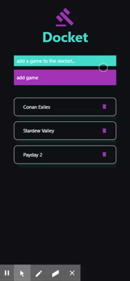

# docket

## Description
Docket is a streamlined mobile app that allows gamers to view, add, and delete games from their list so they can decide on what to play. 

## User Story
Gaming is one of my favorite pastimes with friends. I would like to keep a current list of our favorite games to play so that we can make a quick decision on what to play when we get together. I need a streamlined app that will allow me to view, add, and delete games from the docket.

## Instructions
Add games you want to play into the input box and click the "add game" button to add them to the list - remove games by clicking the trash icon

## Links
* [Github](https://github.com/markohanesian/docket)

## Built With
* React Native
* Material UI
* Expo

## Planned Features/Outstanding Issues
* Functional login and signup 
* Updated UI
* Account collaboration

## Authors
* [Mark Ohanasian](https://github.com/markohanesian) 

## Acknowledgments
* React Native Tutorial #9 - Todo App made by The Net Ninja[link]{https://www.youtube.com/watch?v=uLHFPt9B2Os)

## License

* [MIT](https://opensource.org/licenses/MIT)

